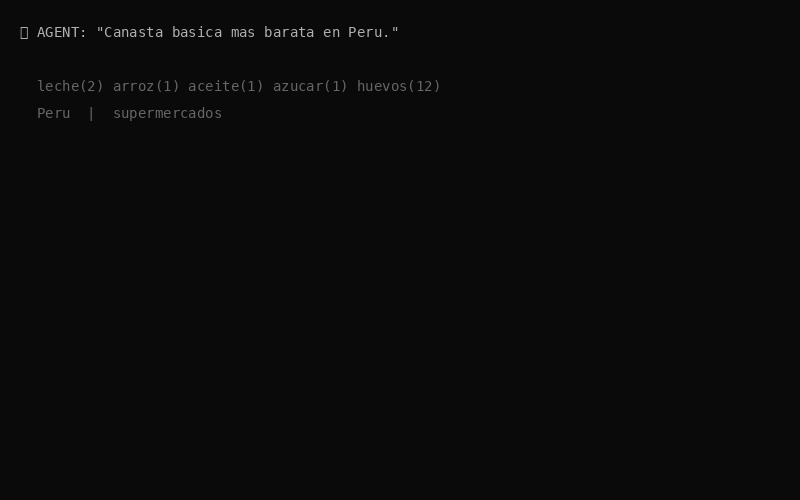

<!-- readme-hero -->
<div align="center">



</div>

# cli-market-core

> **Intelligence Layer** — Indicators, billing, connectors, and MCP tools for CLI Market

```bash
pip install cli-market-core
```

---

## What is this?

`cli-market-core` is the intelligence engine of the CLI Market ecosystem. It takes canonical product data from `cli-market-index` and adds market intelligence: price indicators, spread analysis, billing/payments, retailer connectors, and 43 MCP tools.

---

## Ecosystem

```
cli-market-backend  ->  Data ingestion (scrapers, FastAPI)
cli-market-index    ->  Semantic Refinery (entity resolution, Golden Records)
cli-market-core     ->  Intelligence (THIS REPO)
cli-market-world    ->  Exposure (landing, docs, MCP registry)
```

---

## Modules

| Module | Role |
|---|---|
| `market_core.py` | Core service orchestrator |
| `market_indicators.py` | 34 market indicators from shelf data |
| `market_spread.py` | Cross-retailer price spreads |
| `market_stats.py` | Platform statistics and version |
| `market_db.py` | Database access layer |
| `market_mcp.py` | 43 MCP tool definitions |
| `market_basket.py` | Basket comparison logic |
| `market_billing.py` | Subscription and billing |
| `market_alerts.py` | Price alert engine |
| `market_security.py` | Auth and webhook validation |
| `market_intel_agent.py` | AI agent intelligence queries |
| `market_enrich_sources.py` | External data enrichment (OFF, IMF, World Bank) |
| `market_enrich_subcategory.py` | Subcategory classification |
| `market_health_alert.py` | System health monitoring |
| `source_health.py` | Scraper health tracking |
| `price_confidence.py` | Price quality heuristics |
| `store_credentials.py` | Retailer credential management |
| `market_units.py` | Unit conversion utilities |
| `market_stores.py` | Retailer catalog |
| `retailer_onboarding.py` | Retailer onboarding workflow |
| `dashboard_glossary.py` | Dashboard metric definitions |
| `dashboard_quality.py` | Dashboard quality indicators |
| `dashboard_renderer.py` | Dashboard HTML renderer |
| `dashboard_view_model.py` | Dashboard data model |
| `data_v1_service.py` | Core data API endpoints |
| `market_connectors/` | PayPal, Mercado Pago, WooCommerce, VTEX, Shopify, SUNAT, etc. |
| `market_stats.py` | Canonical figures for README, PyPI, landing (run `sync_market_stats.py` in world) |

---

## Version

Current: **1.9.5** — 68 retailers, 4 platforms (incl. WooCommerce FMCG pilot `nunaorganica_pe`)

---

## Dev setup

```bash
pip install -e .
```

No external dependencies required in creation phase.

MIT License · [SINAPSIS INNOVADORA S.A.C.](https://cli-market.dev) · Lima, Peru
