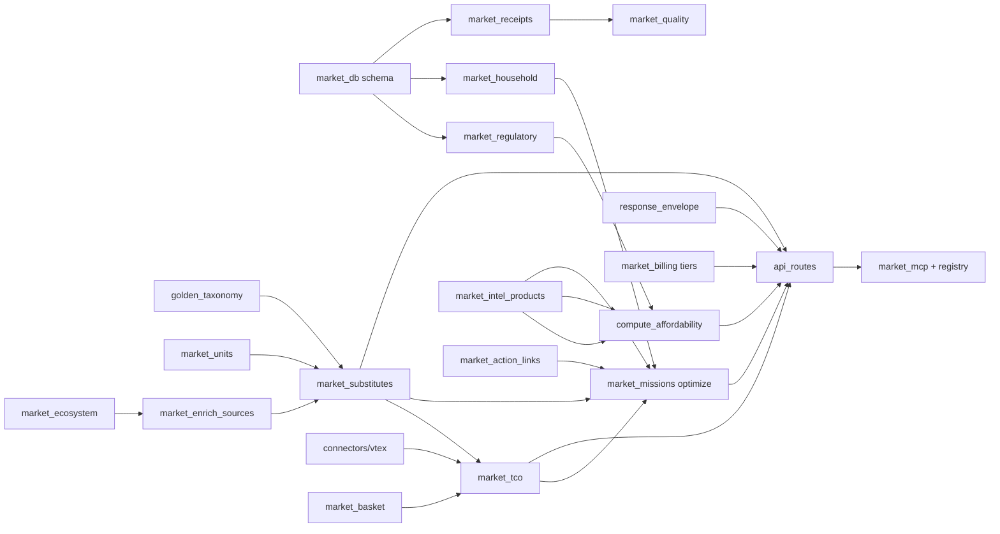

# PRD — Desglose por módulos

> Companion de [`PRD-COST-OF-LIVING-OS.md`](./PRD-COST-OF-LIVING-OS.md).  
> Cada sección = un módulo (o paquete) con tickets implementables, dependencias y CAs.

**Leyenda:** `W1` oleada 1 · `W2` oleada 2 · `W3` oleada 3 · `EXT` repo externo

---

## Grafo de dependencias



---

## M1 — `market_db.py` (schema)

| Campo | Valor |
|-------|-------|
| **Oleada** | W1 → W3 (migraciones incrementales) |
| **Owner** | core |

### Tickets

| ID | Título | Oleada | CAs |
|----|--------|--------|-----|
| M1-1 | DDL `regulatory_events` SQLite + PG | W1 | Tabla existe; idempotente en `init_db` |
| M1-2 | DDL `household_profiles` | W2 | FK lógica `username`; migrate up/down |
| M1-3 | DDL `receipt_submissions` | W3 | status enum; índice `(country, store, created_at)` |
| M1-4 | DDL `ecosystem_launches_cache` | W3 | Reuse patrón `enrichment_cache` |
| M1-5 | DDL `shopping_list_exports` (token, payload, expires_at) | W2 | TTL 72h; purge job opcional |

### Archivos

- `market_core/market_db.py` — migraciones `_migrate_*`
- `tests/test_market_db_layer.py`

### Depende de

- Nada (desbloquea M2, M10, M14, M16)

---

## M2 — `market_regulatory.py` *(nuevo)*

| Campo | Valor |
|-------|-------|
| **Oleada** | W1 |
| **Owner** | core |

### API pública

```python
def list_regulatory_events(db, *, country: str, days: int = 90, category: str | None = None) -> list[dict]
def upsert_regulatory_event(db, event: dict) -> dict  # admin
def regulatory_headlines(db, country: str, limit: int = 3) -> list[dict]
```

### Tickets

| ID | Título | CAs |
|----|--------|-----|
| M2-1 | Implementar `list_regulatory_events` + sort `effective_at` desc | CA-R1, CA-R2 |
| M2-2 | Admin `upsert_regulatory_event` con validación category enum | — |
| M2-3 | Seed script `ops/seed_regulatory_pe_ar.py` (≥3 PE, ≥2 AR) | CA-R3 |
| M2-4 | Tests offline con SQLite fixture | — |

### Integra con

- `market_intel_products.compute_inflation_report` → `regulatory_headlines`
- `compute_affordability` → `regulatory_headlines`

### Depende de

- M1-1

---

## M3 — `market_intel_products.py`

| Campo | Valor |
|-------|-------|
| **Oleada** | W1 (+ W3 bulk) |
| **Owner** | core |

### Tickets

| ID | Título | CAs |
|----|--------|-----|
| M3-1 | `compute_affordability(db, country, line, days)` + bands + score | CA-A1, CA-A2, CA-A5 |
| M3-2 | Integrar `golden_taxonomy.min_canasta_prices_golden` con fallback `market_basket` | CA-A1 |
| M3-3 | Extender `compute_inflation_report` con `regulatory_headlines` | CA-R2 |
| M3-4 | `compute_procurement_bulk(db, org_id, lines[])` | W3 — enterprise |
| M3-5 | Tests: affordability vacío, affordability con fixture canasta | CA-A2 |

### Response contract

Ver PRD §6.1 `AffordabilityReport` — campos obligatorios: `affordability_score`, `affordability_band`, `headline_es`, `disclaimer_es`, `components`.

### Depende de

- M2 (regulatory headlines)
- M7 golden taxonomy (canasta golden)
- `market_indicators` (señales existentes)

---

## M4 — `market_tco.py` *(nuevo)*

| Campo | Valor |
|-------|-------|
| **Oleada** | W1 |
| **Owner** | core |

### API pública

```python
def compute_line_tco(
    *,
    shelf_subtotal: float,
    delivery: dict | None,
    payment_method: str = "yape",
    fx: dict | None = None,
) -> dict

def build_basket_tco(db, country: str, store: str, items: list[dict], **opts) -> dict
```

### Tickets

| ID | Título | CAs |
|----|--------|-----|
| M4-1 | `compute_line_tco` — shelf + delivery + payment fee table | CA-T1 |
| M4-2 | `build_basket_tco` — resuelve items vía search interno | CA-T2 |
| M4-3 | Integrar `market_units.price_per_base_unit` en line items | — |
| M4-4 | Tier gate: free sin delivery fee (preview mode) | CA-T3 |
| M4-5 | Tests: sin delivery, con delivery, min_order_gap | CA-T1 |

### Depende de

- M5 `market_basket` / `data_v1_service`
- M13 `market_connectors/vtex` shipping sim
- M17 `commerce_capabilities` fee table

---

## M5 — `market_basket.py` + `data_v1_service.py`

| Campo | Valor |
|-------|-------|
| **Oleada** | W1 |
| **Owner** | core |

### Tickets

| ID | Título | CAs |
|----|--------|-----|
| M5-1 | `build_basket_compare(..., include_tco=False)` → añadir bloque `tco` por store | CA-T2 |
| M5-2 | `query_basket_tco` en `data_v1_service` para `/v1/basket/tco` | — |
| M5-3 | `enveloped=True` en respuestas TCO con provenance | CA-T2 |
| M5-4 | Tests basket compare con TCO mock delivery | — |

### Depende de

- M4 `market_tco`

---

## M6 — `market_substitutes.py` *(nuevo)*

| Campo | Valor |
|-------|-------|
| **Oleada** | W1 |
| **Owner** | core |

### API pública

```python
def find_substitutes(
    db,
    *,
    query: str,
    country: str,
    store: str | None = None,
    limit: int = 3,
    constraints: dict | None = None,
) -> dict
```

### Tickets

| ID | Título | CAs |
|----|--------|-----|
| M6-1 | Pipeline: search → canonical_id → unit norm → rank | CA-S1 |
| M6-2 | Filtros `constraints` (nova, nutriscore, canasta_item) | CA-S2 |
| M6-3 | OFF enrichment top-N vía `resolve_off_for_product` | — |
| M6-4 | Tier gate: free `limit=1`, starter+ `limit=3` | tier matrix |
| M6-5 | Tests: sin registry, con registry, constraints violados | CA-S2, CA-S3, CA-S4 |

### Depende de

- M7 `golden_taxonomy`
- M8 `market_units`
- M9 `market_enrich_sources` (OFF)
- `market_core` search path

---

## M7 — `golden_taxonomy.py`

| Campo | Valor |
|-------|-------|
| **Oleada** | W1 |
| **Owner** | core + **cli-market-index** |

### Tickets

| ID | Título | CAs |
|----|--------|-----|
| M7-1 | `resolve_canonical_id(db, product_id, name)` helper público | — |
| M7-2 | `equivalent_products(db, canonical_id, country)` para substitutes | CA-S1 |
| M7-3 | Documentar contrato index → core registry refresh | — |
| M7-4 | Test: substitute grouping con registry fixture | — |

### EXT — cli-market-index

| ID | Título |
|----|--------|
| M7-EXT-1 | Export registry incluye `substitute_group` opcional |
| M7-EXT-2 | Job refresh ≥1x/día en producción |

---

## M8 — `market_units.py`

| Campo | Valor |
|-------|-------|
| **Oleada** | W1 |
| **Owner** | core |

### Tickets

| ID | Título | CAs |
|----|--------|-----|
| M8-1 | Exponer `compare_unit_price(a, b)` para substitutes | — |
| M8-2 | Tests packs edge LATAM (maple, bandeja, docena) en substitute path | — |

*Cambio mínimo esperado — mayormente consumidor de M6/M4.*

---

## M9 — `market_enrich_sources.py`

| Campo | Valor |
|-------|-------|
| **Oleada** | W1 consume · W3 ecosystem |
| **Owner** | core |

### Tickets

| ID | Título | Oleada | CAs |
|----|--------|--------|-----|
| M9-1 | Helper `off_tradeoff(original, candidate)` → nutriscore/nova delta | W1 | — |
| M9-2 | `fetch_ecosystem_launches(topic, days)` + cache `ecosystem_launches_cache` | W3 | — |
| M9-3 | Rate limit + `PRODUCT_HUNT_TOKEN` env guard | W3 | legal PH |

---

## M10 — `market_household.py` *(nuevo)*

| Campo | Valor |
|-------|-------|
| **Oleada** | W2 |
| **Owner** | core |

### API pública

```python
def get_household(db, username: str) -> dict | None
def put_household(db, username: str, payload: dict) -> dict
def patch_household(db, username: str, patch: dict) -> dict
def household_summary(db, username: str) -> dict
```

### Tickets

| ID | Título | CAs |
|----|--------|-----|
| M10-1 | JSON schema v1 validation en PUT/PATCH | CA-H1 |
| M10-2 | `household_summary` — budget_remaining, projected_overspend | — |
| M10-3 | Wire restrictions → `find_substitutes` cuando sesión autenticada | CA-H2 |
| M10-4 | Auth required 401 sin token | CA-H3 |
| M10-5 | Deprecate path: `market_preferences` lee de household si existe | — |

### Depende de

- M1-2
- M18 `auth_tokens` / billing tier

---

## M11 — `market_missions.py`

| Campo | Valor |
|-------|-------|
| **Oleada** | W2 |
| **Owner** | core |

### Tickets

| ID | Título | CAs |
|----|--------|-----|
| M11-1 | `run_optimize_purchase(...)` — orquesta compare+TCO+substitutes+intel | CA-O1 |
| M11-2 | Budget check vía `household_summary` | CA-O3 |
| M11-3 | `action_links` en response vía M12 | CA-O2 |
| M11-4 | Mantener `run_investigate` como alias interno | — |
| M11-5 | Tests integración mock API | CA-O1 |

### Depende de

- M3, M4, M6, M10, M12

---

## M12 — `market_action_links.py` *(nuevo)*

| Campo | Valor |
|-------|-------|
| **Oleada** | W2 (+ W3 L3) |
| **Owner** | core |

### API pública

```python
def retailer_deeplink(store: str, product_id: str, name: str) -> dict | None
def create_shopping_list_export(db, payload: dict, ttl_hours: int = 72) -> dict
def get_shopping_list_export(db, token: str) -> dict | None
```

### Tickets

| ID | Título | CAs |
|----|--------|-----|
| M12-1 | Deeplink VTEX pattern (Wong, Metro, Plaza Vea) | CA-AC1 |
| M12-2 | Deeplink Shopify pattern (disabled stores doc only) | — |
| M12-3 | Export token CRUD + TTL | CA-AC2 |
| M12-4 | W3: `affiliate` flag + UTM template | L3 |

### Depende de

- M1-5
- M13 connectors URL patterns

---

## M13 — `market_connectors/` (VTEX shipping)

| Campo | Valor |
|-------|-------|
| **Oleada** | W1 |
| **Owner** | core |

### Tickets

| ID | Título | CAs |
|----|--------|-----|
| M13-1 | `VtexConnector.estimate_shipping(store, items, postal_code?)` | — |
| M13-2 | Normalizar respuesta → `{fee, min_order, available, source}` | CA-T1 |
| M13-3 | Timeout + fallback graceful | CA-T1 |
| M13-4 | Test mocked HTTP VTEX logistics | — |

### Archivos

- `market_connectors/vtex.py`
- `tests/test_vtex_connector.py`

---

## M14 — `market_receipts.py` *(nuevo)* + ticket OCR

| Campo | Valor |
|-------|-------|
| **Oleada** | W3 |
| **Owner** | core + backend |

### Tickets

| ID | Título | CAs |
|----|--------|-----|
| M14-1 | `submit_receipt(db, url, country, username?)` → OCR + moat_diff | CA-C1 |
| M14-2 | Status machine pending/confirmed/rejected | — |
| M14-3 | Extender handler `market_ticket` con `submit_to_crowd` | — |
| M14-4 | No persistir imagen raw >7d (metadata only) | CA-C2 |
| M14-5 | Wire confirmaciones → M15 quality | CA-C3 |

### Depende de

- M1-3
- Existing `/v1/ticket/scan-url` path

---

## M15 — `market_quality.py`

| Campo | Valor |
|-------|-------|
| **Oleada** | W3 |
| **Owner** | core |

### Tickets

| ID | Título | CAs |
|----|--------|-----|
| M15-1 | `crowd_confidence(db, product_id, store)` | CA-C3 |
| M15-2 | Integrar en `build_data_quality_scores` | CA-C3 |
| M15-3 | GET `/v1/moat/confidence` data function | — |

---

## M16 — `market_ecosystem.py` *(nuevo)*

| Campo | Valor |
|-------|-------|
| **Oleada** | W3 |
| **Owner** | core |

### Tickets

| ID | Título | CAs |
|----|--------|-----|
| M16-1 | `list_launches(db, topic, days, limit)` | — |
| M16-2 | Curated manual fallback sin PH token | legal |
| M16-3 | MCP `market_ecosystem_radar` handler | tier pro+ |

### Depende de

- M9-2, M1-4

---

## M17 — `response_envelope.py`

| Campo | Valor |
|-------|-------|
| **Oleada** | W1–W2 |
| **Owner** | core |

### Tickets

| ID | Título | CAs |
|----|--------|-----|
| M17-1 | `build_provenance(primary, sources, stores_responded, stores_queried)` | — |
| M17-2 | `confidence_from_coverage(coverage_pct)` → ok/warn/low | CA-P2 |
| M17-3 | Documentar en docstring + HANDOFF | CA-P1 |

---

## M18 — `market_billing.py` + tier gates

| Campo | Valor |
|-------|-------|
| **Oleada** | W1–W3 |
| **Owner** | core |

### Tickets

| ID | Título | CAs |
|----|--------|-----|
| M18-1 | `feature_allowed(tier, feature_slug)` centralizado | tier matrix |
| M18-2 | Feature slugs: `tco_delivery`, `substitutes_3`, `optimize_purchase`, `household_write`, `ecosystem_radar`, `procurement_bulk` | — |
| M18-3 | Tests por tier | — |

---

## M19 — `api_routes.py`

| Campo | Valor |
|-------|-------|
| **Oleada** | W1–W3 |
| **Owner** | core (router) · **backend** (mount) |

### Tickets

| ID | Ruta | Oleada |
|----|------|--------|
| M19-1 | `GET /v1/intel/affordability` | W1 |
| M19-2 | `GET /v1/products/substitutes` | W1 |
| M19-3 | `GET /v1/basket/tco` | W1 |
| M19-4 | `GET /v1/intel/regulatory` | W1 |
| M19-5 | `GET/PUT/PATCH /v1/household` + `/summary` | W2 |
| M19-6 | `POST /v1/missions/optimize-purchase` | W2 |
| M19-7 | `POST/GET /v1/export/shopping-list/{token}` | W2 |
| M19-8 | `POST /v1/receipts/submit`, `GET /v1/moat/confidence` | W3 |
| M19-9 | `GET /v1/ecosystem/launches` | W3 |
| M19-10 | `POST /v1/intel/procurement-bulk` | W3 |
| M19-11 | OpenAPI schemas AffordabilityReport, SubstitutesReport, TcoReport | W1 |

### CAs transversales

- Todas las rutas nuevas: `enveloped=True` por defecto
- CA-P1 OpenAPI

### EXT — cli-market-backend

| ID | Título |
|----|--------|
| M19-EXT-1 | Mount router + auth middleware household |
| M19-EXT-2 | Deploy staging smoke cada ruta |

---

## M20 — `market_mcp_registry.py` + `market_mcp.py`

| Campo | Valor |
|-------|-------|
| **Oleada** | W1–W3 |
| **Owner** | core |

### Tickets

| ID | Tool | Acción | Default profile |
|----|------|--------|-----------------|
| M20-1 | `market_affordability` | Nuevo | Sí |
| M20-2 | `market_substitutes` | Nuevo | Sí |
| M20-3 | `market_basket` / `market_compare` | +`include_tco` | Sí |
| M20-4 | `market_intel_brief` | +affordability summary | Sí |
| M20-5 | `market_optimize_purchase` | Nuevo | Sí |
| M20-6 | `market_household_get/update` | Nuevo | No (account) |
| M20-7 | `market_ecosystem_radar` | Nuevo | No |
| M20-8 | `market_procurement_bulk` | Nuevo | No |
| M20-9 | Actualizar `_DEFAULT_HIDDEN` / profile counts 24→27 | — | — |
| M20-10 | Handlers en `market_mcp.py` | — | — |
| M20-11 | Tests `test_mcp_registry.py` profile count | — | — |

### EXT — cli-market-world

| ID | Título |
|----|--------|
| M20-EXT-1 | README/landing 24→27 curated tools |
| M20-EXT-2 | `public_tool_count("default") == 27` verify script |

---

## M21 — `market_observatory.py`

| Campo | Valor |
|-------|-------|
| **Oleada** | W1–W3 |
| **Owner** | core |

### Tickets

| ID | Título |
|----|--------|
| M21-1 | `query_type` enum: affordability, tco, substitute, optimize, receipt_crowd, ecosystem |
| M21-2 | `_REST_TOOL_ALIASES` nuevas rutas |
| M21-3 | Dashboard top tools incluye optimize_purchase |

---

## M22 — `commerce_capabilities.py`

| Campo | Valor |
|-------|-------|
| **Oleada** | W1 |
| **Owner** | core |

### Tickets

| ID | Título | CAs |
|----|--------|-----|
| M22-1 | Sección `tco` con scope y límites por tier | CA-T4 |
| M22-2 | Sección `action_closure` L1-L2 | — |

---

## M23 — Tests (por oleada)

| Paquete | Archivos nuevos |
|---------|-----------------|
| W1 | `tests/test_affordability.py`, `tests/test_substitutes.py`, `tests/test_tco.py`, `tests/test_regulatory.py` |
| W2 | `tests/test_household.py`, `tests/test_optimize_purchase.py`, `tests/test_action_links.py`, `tests/test_provenance.py` |
| W3 | `tests/test_receipts_crowd.py`, `tests/test_ecosystem.py`, `tests/test_procurement_bulk.py` |

### Gate CI

```
CI=true MARKET_SKIP_LIVE=1 python3 -m pytest -q -m "not integration"
```

Cobertura módulos nuevos ≥65% cada uno.

---

## M24 — Documentación downstream

| Repo | Archivo | Cuándo |
|------|---------|--------|
| core | `HANDOFF.md` | W1 |
| core | `BACKEND_CHANGES.md` | W1, W2 |
| world | `WORLD_CHANGES.md` | W2 (27 tools) |
| world | README curated count | W2 |

---

## Orden de implementación sugerido

### Sprint A (W1 foundation)

```
M1-1 → M2-* → M17-1 → M3-1,M3-2,M3-3
M13-* → M4-* → M5-* → M7-* → M6-* → M8-1
M19-1..4,11 → M20-1..4 → M22-1 → M23 W1
```

### Sprint B (W2 agent OS)

```
M1-2,M1-5 → M10-* → M12-* → M11-*
M17-2,3 → M19-5..7 → M20-5,6,9,10
M18-* → M21-* → M23 W2 → M24
```

### Sprint C (W3 scale)

```
M1-3,M1-4 → M14-* → M15-* → M9-2 → M16-*
M3-4 → M19-8..10 → M20-7,8 → M23 W3
```

---

## Mapa issues GitHub

Cada módulo `M1`–`M24` tiene un issue epic en GitHub. Labels: `enhancement`, `repo-core`.

| Issue | Módulo | Oleada |
|-------|--------|--------|
| [#46](https://github.com/Treevu-ai/cli-market-core/issues/46) | M1 market_db | W1–W3 |
| [#47](https://github.com/Treevu-ai/cli-market-core/issues/47) | M2 market_regulatory | W1 |
| [#48](https://github.com/Treevu-ai/cli-market-core/issues/48) | M3 market_intel_products | W1, W3 |
| [#49](https://github.com/Treevu-ai/cli-market-core/issues/49) | M4 market_tco | W1 |
| [#50](https://github.com/Treevu-ai/cli-market-core/issues/50) | M5 market_basket | W1 |
| [#51](https://github.com/Treevu-ai/cli-market-core/issues/51) | M6 market_substitutes | W1 |
| [#52](https://github.com/Treevu-ai/cli-market-core/issues/52) | M7 golden_taxonomy | W1 |
| [#53](https://github.com/Treevu-ai/cli-market-core/issues/53) | M8 market_units | W1 |
| [#54](https://github.com/Treevu-ai/cli-market-core/issues/54) | M9 market_enrich_sources | W1, W3 |
| [#55](https://github.com/Treevu-ai/cli-market-core/issues/55) | M10 market_household | W2 |
| [#56](https://github.com/Treevu-ai/cli-market-core/issues/56) | M11 market_missions | W2 |
| [#57](https://github.com/Treevu-ai/cli-market-core/issues/57) | M12 market_action_links | W2, W3 |
| [#58](https://github.com/Treevu-ai/cli-market-core/issues/58) | M13 market_connectors | W1 |
| [#59](https://github.com/Treevu-ai/cli-market-core/issues/59) | M14 market_receipts | W3 |
| [#60](https://github.com/Treevu-ai/cli-market-core/issues/60) | M15 market_quality | W3 |
| [#61](https://github.com/Treevu-ai/cli-market-core/issues/61) | M16 market_ecosystem | W3 |
| [#62](https://github.com/Treevu-ai/cli-market-core/issues/62) | M17 response_envelope | W1–W2 |
| [#63](https://github.com/Treevu-ai/cli-market-core/issues/63) | M18 market_billing | W1–W3 |
| [#64](https://github.com/Treevu-ai/cli-market-core/issues/64) | M19 api_routes | W1–W3 |
| [#65](https://github.com/Treevu-ai/cli-market-core/issues/65) | M20 market_mcp | W1–W3 |
| [#66](https://github.com/Treevu-ai/cli-market-core/issues/66) | M21 market_observatory | W1–W3 |
| [#67](https://github.com/Treevu-ai/cli-market-core/issues/67) | M22 commerce_capabilities | W1 |
| [#68](https://github.com/Treevu-ai/cli-market-core/issues/68) | M23 tests | W1–W3 |
| [#69](https://github.com/Treevu-ai/cli-market-core/issues/69) | M24 docs downstream | W1–W2 |

### Repos externos (tickets en issues core)

| Parent | EXT | Repo |
|--------|-----|------|
| M7 #52 | M7-EXT-1/2 | cli-market-index |
| M19 #64 | M19-EXT-1/2 | cli-market-backend |
| M20 #65 | M20-EXT-1/2 | cli-market-world |
